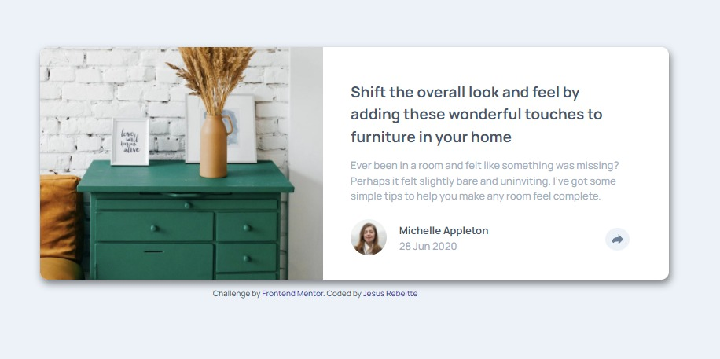

# Frontend Mentor - Article preview component solution

This is a solution to the [Article preview component challenge on Frontend Mentor](https://www.frontendmentor.io/challenges/article-preview-component-dYBN_pYFT). Frontend Mentor challenges help you improve your coding skills by building realistic projects. 

## Table of contents

- [Frontend Mentor - Article preview component solution](#frontend-mentor---article-preview-component-solution)
  - [Table of contents](#table-of-contents)
  - [Overview](#overview)
    - [The challenge](#the-challenge)
    - [Screenshot](#screenshot)
    - [Links](#links)
  - [My process](#my-process)
    - [Built with](#built-with)
    - [What I learned](#what-i-learned)
    - [Continued development](#continued-development)
  - [Author](#author)

**Note: Delete this note and update the table of contents based on what sections you keep.**

## Overview

### The challenge

Users should be able to:

- View the optimal layout for the component depending on their device's screen size
- See the social media share links when they click the share icon

### Screenshot

### Links

- Solution URL: [Add solution URL here](https://github.com/Rebeitte/article-preview-component)
- Live Site URL: [Live Site](https://article-preview-componen-jr.netlify.app/)

## My process

### Built with

- Semantic HTML5 markup
- CSS custom properties
- Flexbox
- CSS Grid
- Mobile-first workflow
- Vanilla Javascript
- 
### What I learned

I learned how to use the event "Click" to control the DOM using javascript, this learped me a lot to control the when the share box appears on the page. 

### Continued development

For the next projects I want to focus on the javascript learning (mainly in functions), also I'll be using SASS for the next project. 

## Author
- Frontend Mentor - [@rebeitte](https://www.frontendmentor.io/profile/Rebeitte)
- Twitter - [@jesusrebeitte](https://twitter.com/jesusrebeitte)
